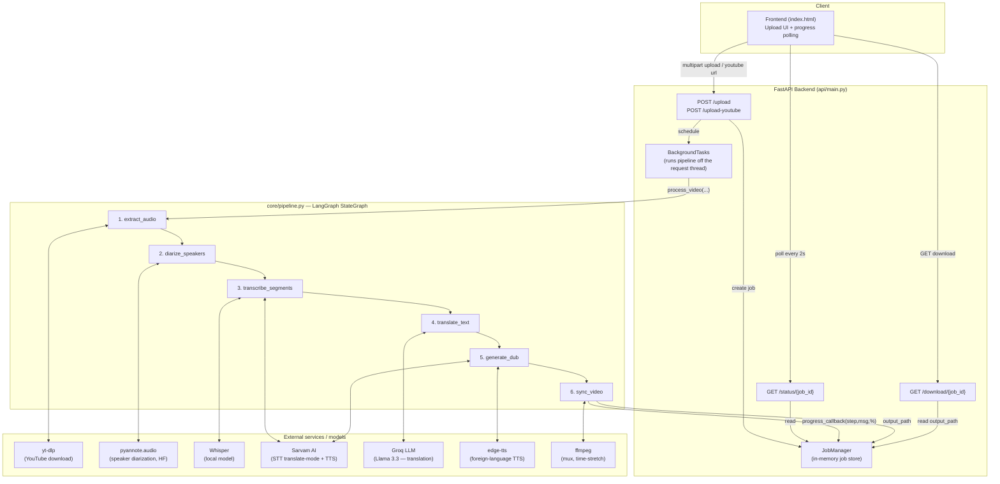

# Architecture

## System overview

## Request lifecycle

1. **Upload**: Client sends a file or YouTube URL to `/upload` or `/upload-youtube`.
   The endpoint validates language, engine, and file type/duration *before*
   touching the pipeline, creates a `Job` in `JobManager`, and schedules
   `run_dubbing_job()` as a FastAPI `BackgroundTask`. The response (job_id)
   returns immediately — the client never waits for dubbing to finish on this request.

2. **Processing**: `run_dubbing_job()` calls `DubbingPipeline.process_video()`,
   passing a `progress_callback`. The LangGraph pipeline runs its six nodes
   sequentially, each one calling `self._report(...)` at the start, which
   invokes the callback to update the job's `progress_step` / `progress_percent`
   in `JobManager`.

3. **Polling**: The frontend polls `GET /status/{job_id}` every 2 seconds and
   updates a step-by-step UI. No websockets — simple and sufficient given
   dubbing jobs run for tens of seconds to minutes, not real-time.

4. **Download**: Once `status == completed`, `GET /download/{job_id}` streams
   the finished MP4 from disk.

## LangGraph pipeline (core/pipeline.py)

A `StateGraph` with a single `DubbingState` TypedDict flowing through six
nodes, added and wired in a strictly linear chain
(`extract_audio → diarize_speakers → transcribe_segments → translate_text → generate_dub → sync_video → END`).

| Node | Responsibility | Key external call |
|---|---|---|
| `extract_audio` | Download (if YouTube) + extract WAV from video | yt-dlp, pydub |
| `diarize_speakers` | Split audio by speaker + estimate each speaker's gender via pitch (librosa) | pyannote.audio |
| `transcribe_segments` | Convert each speaker's audio to English text | Whisper (local) or Sarvam (translate mode) |
| `translate_text` | English → target language, natural spoken style | Groq (Llama 3.3) |
| `generate_dub` | Text → speech per speaker, gender-matched voice | Sarvam TTS (Indian) or edge-tts (foreign) |
| `sync_video` | Time-stretch each dubbed clip to its original slot, overlay onto a silent base track, mux with ffmpeg | ffmpeg |

Each node reads only the state keys it needs and returns a partial dict that
LangGraph merges into the running state — this keeps nodes independently
testable (see `tests/test_pipeline.py`), since a node can be called directly
with a hand-built `state` dict and mocked components.

## Why LangGraph instead of a plain function chain?

See `DESIGN_DECISIONS.md`.